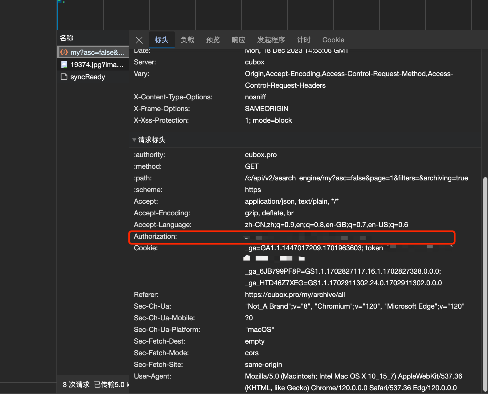

# Obsidian-Cubox-Import

## Description
Obsidian-Cubox-Import is an Obsidian plugin designed to enhance your note-taking experience. This plugin allows you to seamlessly download and extract data from Cubox and integrate it into your Obsidian vault.

## Features
- Sync data from Cubox directly into your Obsidian vault.
- Customizable settings for file paths and Cubox tokens.
- Easy-to-use interface integrated within Obsidian.

## Installation
To install MyPlugin:
1. Open Obsidian and go to `Settings`.
2. Navigate to `Community Plugins`.
3. Disable `Safe Mode`.
4. Click on `Browse` and search for `obsidian-cubox-import`.
5. Install the plugin and enable it.

Alternatively, you can manually install the plugin by downloading it from this GitHub repository and placing it in your Obsidian vault's plugins folder.

## Usage
After installing MyPlugin, you can:
1. Access the plugin settings to configure your Cubox token and file path.
2. Use the ribbon icon to sync data from Cubox.
3. Access new commands added by MyPlugin in the command palette.

## Configuration
Configure MyPlugin in the plugin settings tab:
- **Cubox Token**: Enter your token from the Cubox website.

- **File Path**: Set the path where you want the Cubox markdown files to be stored.

## Support
For support, questions, or feedback, please open an issue in this GitHub repository.

## Acknowledgements
Thanks to YANG Hao who inspired me to develop this plugin and the developers of Cubox for making this integration possible.
